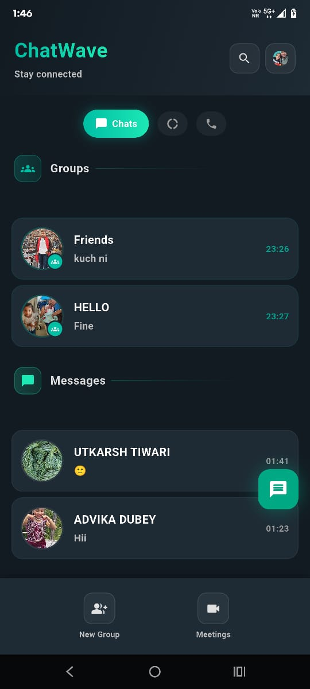
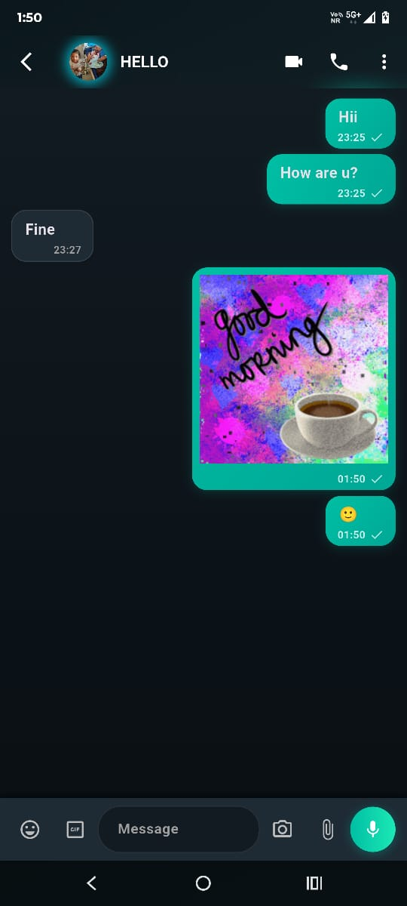
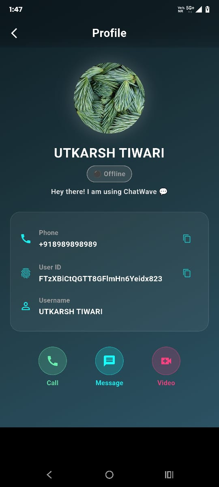
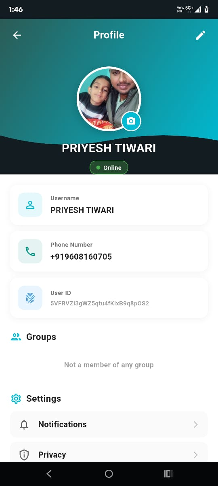

# ChatWave - Real-time Messaging & Communication Platform

A feature-rich Flutter messaging application with real-time communication, audio/video calling, group chat, and story features powered by Firebase and Agora SDK.

## 📱 Download & Try

**[Download APK]([paste-your-mediafire-link-here](https://www.mediafire.com/file/zbv8ubwjocrkehb/app-arm64-v8a-release.apk/file))**

## 🧪 Test Login Credentials

Since Firebase Phone OTP requires active billing, use these test credentials:

**Test Phone Numbers:**
- Phone: 9608160705
- OTP: 929292

OR

- Phone: 8989898989
- OTP: 898989

Simply enter the phone number, click "Get OTP", then enter the OTP shown above.

## ✨ Features

### Authentication & Profile
- 🔐 Firebase Phone OTP Authentication
- 👤 User Profile Management
- 📸 Profile Picture Upload
- ✏️ Custom Status & Bio

### Messaging
- 💬 Real-time Personal Chat
- 👥 Group Chat with Admin Controls
- 📷 Image Sharing
- 🎥 Video Sharing
- 🎬 GIF Support
- 🎤 Audio Messages
- ✓✓ Message Read Receipts
- ⏱️ Real-time Message Synchronization
- 🔍 Message Search
- 📌 Pin Important Chats

### Communication
- 📞 Audio Calling (Agora SDK)
- 📹 Video Calling (Agora SDK)
- 👥 Group Video Calls
- 🔗 Meeting Link Generation
- 📊 Call History Tracking

### Stories
- 📸 24-hour Story Feature
- ⏰ Automatic Story Expiration
- 👁️ Story Views Tracking
- 📱 Image & Video Stories
- ✍️ Text Stories

### Group Features
- 👥 Create Groups
- 🎨 Custom Group Icons
- 👑 Admin Controls
- ➕ Add/Remove Members
- 📢 Group Announcements
- 🔕 Mute Notifications

### Additional Features
- 🟢 Online/Offline Status
- ⌨️ Typing Indicators
- 🔔 Push Notifications
- 🌙 Dark Mode Support
- 📱 Responsive UI Design
- 🔄 Real-time Data Sync

## 🛠️ Tech Stack

- **Framework:** Flutter 3.x
- **Language:** Dart
- **Authentication:** Firebase Authentication (Phone OTP)
- **Database:** Cloud Firestore (Real-time Database)
- **Storage:** Firebase Storage, Cloudinary
- **Real-time Communication:** Agora SDK (Audio/Video Calling)
- **State Management:** Riverpod (StateNotifier, Provider, Consumer)
- **Development Tools:** Android Studio, VS Code, Git/GitHub, Firebase Console

## 📸 Screenshots

### Authentication & Home
<p align="center">
  
  
  
  
</p>

### Messaging & Profile
<p align="center">
  
  
  
  
</p>

### Calling Features
<p align="center">
  
  
  
</p>

### Meeting Features
<p align="center">
  
  
</p>
## 🏗️ Key Technical Implementations

### Real-time Messaging
- Cloud Firestore real-time listeners for instant message delivery
- Efficient query optimization for chat history
- Message batching for performance
- Automatic retry mechanism for failed messages
- Offline message queuing

### Audio/Video Calling
- Agora RTC Engine integration
- Real-time video encoding/decoding
- Network quality monitoring
- Automatic quality adjustment
- Call recording capability
- Screen sharing support

### State Management
- Riverpod for reactive state management
- StateNotifier for complex state logic
- Provider pattern for dependency injection
- Efficient widget rebuilding
- Memory-optimized state handling

### Firebase Implementation
- Phone OTP authentication with auto-verification
- Cloud Firestore for real-time data sync
- Firebase Storage for media files
- Cloudinary for image optimization
- Security rules for data protection
- Efficient indexing for queries

### Story Feature
- 24-hour automatic expiration
- View tracking and analytics
- Compressed media upload
- Sequential story viewing
- Reply to story functionality

### Group Chat
- Admin role management
- Member permissions
- Group metadata sync
- Optimized for large groups
- Message broadcasting

## 🚀 Getting Started

### Prerequisites
- Flutter SDK (3.0 or higher)
- Dart SDK
- Android Studio or VS Code
- Firebase Account
- Agora Account (for audio/video calling)
- Cloudinary Account (optional, for media optimization)

### Installation

1. Clone the repository
```bash
git clone https://github.com/priyesh-tiwari/chatWave.git
cd chatWave
```

2. Install dependencies
```bash
flutter pub get
```

3. Configure Firebase
- Add `google-services.json` to `android/app/` (for Android)
- Add `GoogleService-Info.plist` to `ios/Runner/` (for iOS)
- Enable Phone Authentication in Firebase Console

4. Configure Agora
- Get your Agora App ID from [Agora Console](https://console.agora.io/)
- Add App ID to your configuration file

5. Configure Cloudinary (Optional)
- Get API credentials from [Cloudinary](https://cloudinary.com/)
- Add to configuration file

6. Run the app
```bash
flutter run
```

## 📦 Key Dependencies
```yaml
firebase_core: ^x.x.x              # Firebase initialization
firebase_auth: ^x.x.x              # Phone authentication
cloud_firestore: ^x.x.x            # Real-time database
firebase_storage: ^x.x.x           # File storage
flutter_riverpod: ^x.x.x           # State management
agora_rtc_engine: ^x.x.x           # Audio/video calling
image_picker: ^x.x.x               # Image selection
cached_network_image: ^x.x.x       # Image caching
uuid: ^x.x.x                       # Unique ID generation
```

## 🎯 Project Structure
```
lib/
├── features/
│   ├── auth/              # Authentication logic
│   ├── chat/              # Chat functionality
│   ├── group/             # Group chat
│   ├── call/              # Audio/video calling
│   ├── status/            # Story feature
│   └── profile/           # User profile
├── models/                # Data models
├── providers/             # Riverpod providers
├── widgets/               # Reusable widgets
├── utils/                 # Helper functions
└── main.dart              # App entry point
```

## 🔒 Security Features

- Firebase security rules for data access control
- Phone number verification
- Encrypted message storage
- Secure file uploads
- Rate limiting on API calls
- Input sanitization

## 👨‍💻 Developer

**Priyesh Tiwari**
- **GitHub:** [@priyesh-tiwari](https://github.com/priyesh-tiwari)
- **LinkedIn:** [priyesh-tiwari](https://linkedin.com/in/priyesh-tiwari)
- **Email:** priyesh.garhwa@gmail.com

**Education:** B.Tech in Computer Science & Engineering  
**Institution:** Birsa Institute of Technology, Sindri, Dhanbad, Jharkhand  
**CGPA:** 7.02/10.0

## 🏆 Achievements

- Solved 400+ Data Structures & Algorithms problems on LeetCode and GeeksforGeeks
- JEE Mains 2022: AIR 35,116 (96.104 percentile) among 1M+ candidates
- Certified: "Flutter & Dart – The Complete Guide [2025]" – Udemy

## 📝 License

This project is created for portfolio demonstration purposes.

## 🤝 Contributing

This is a portfolio project. Feel free to fork and modify for your learning purposes.

## 🙏 Acknowledgments

- Flutter Team
- Firebase
- Agora SDK
- Riverpod Community
- Cloudinary

## 📧 Contact

For any queries or collaboration opportunities:
- Email: priyesh.garhwa@gmail.com
- LinkedIn: [Connect with me](https://linkedin.com/in/priyesh-tiwari)

## 🚧 Known Issues & Future Enhancements

### Future Features
- End-to-end encryption
- Message reactions
- Voice notes transcription
- Multi-device support
- Chat backup/restore
- Message scheduling
- Live location sharing
- Payment integration

---

⭐ **If you find this project useful, please consider giving it a star!**

💼 **Open to Flutter Development opportunities** | Available for immediate joining | Seeking internship/full-time roles
